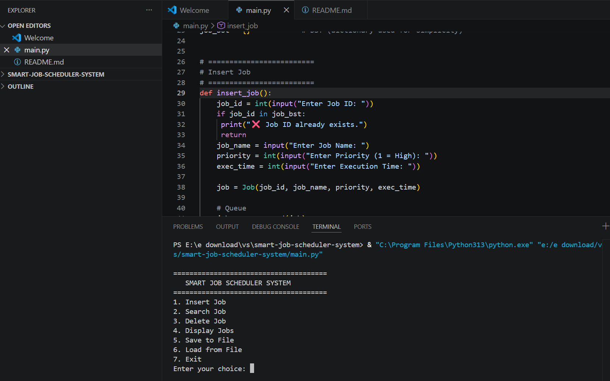
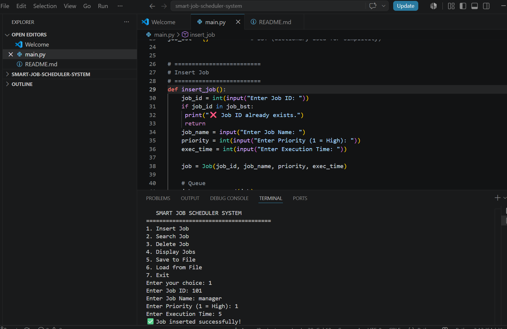
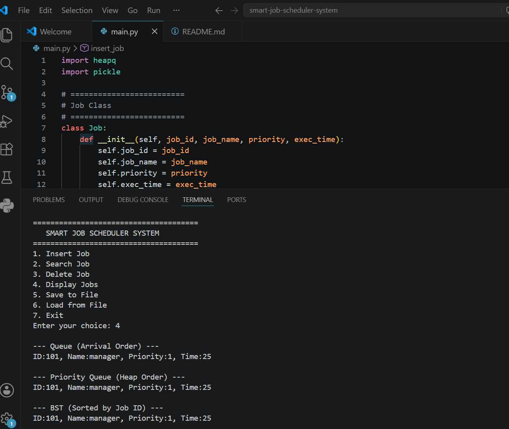

# Smart Job Scheduler System

## Overview
This is a Python-based Smart Job Scheduler System developed as a university Data Structures project. It demonstrates how different data structures can be used to manage and schedule jobs efficiently.

## Features
- Insert a new job
- Search a job by ID
- Delete a job
- Display all jobs
- Save and load data using file handling

## Data Structures Used
- Queue (FCFS)
- Priority Queue (Heap)
- Binary Search Tree (BST - simulated using a dictionary)

## Technologies
- Python
- Heapq
- Pickle

## How to Run
1. Make sure Python is installed.
2. Download or clone this repository.
3. Open the project folder.
4. Run:

```bash
python main.py
```

## Future Improvements
- Implement a real Binary Search Tree class
- Add input validation
- Create a graphical user interface (GUI)

## Author
Amna Asif
BS Software Engineering


## Screenshots

### Main Menu


### Insert Job


### Search Job


### Display Jobs
